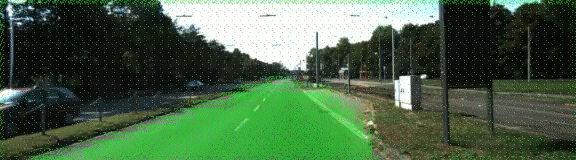

# Semantic Segmentation
### Introduction
In this project, classified the pixels of a road in images using a Fully Convolutional Neural Network (FCN).

### Setup
##### Frameworks and Packages
Software packages required:
 - [Python 3](https://www.python.org/)
 - [TensorFlow](https://www.tensorflow.org/)
 - [NumPy](http://www.numpy.org/)
 - [SciPy](https://www.scipy.org/)
##### Dataset
Downloaded the [Kitti Road dataset](http://www.cvlibs.net/datasets/kitti/eval_road.php) from [here](http://www.cvlibs.net/download.php?file=data_road.zip). and extracted the dataset in the `data` folder.  This will create the folder `data_road` with all the training a test images.
For optional video inferencing used `project_video.mp4` and converted it into .png files inside `data_road`.

### Start
##### Implement
Implemented the code in the `main.py` module indicated as a Rubric points.

##### Run
Following command used to run the project:
```
python main.py
```

### Rubric points discussion

- Project loads the pretrained `vgg` model using `load_vgg`
- learns the correct features from the images through `layers`
- optimizes the neural network using `optimize` function.
- project trains the neural network through function `train_nn` and loss is logged.
- It's observed that loss, decreases over time. As epochs increases loss decreases more.
- Number of epochs tried out as 6, 15 and 40. Increasing epochs shows improvement
- Model labels most of part of image road

#### Output files

As epochs increases loss seen decreasing and gave better output.
Image and video clip shows clear difference

##### Epoch 6

##### Epoch 15

##### Epoch 40


#### Epochs clips



#### Optional video clip inferencing
Use `project_video.mp4` for processing on video. For simplicity, generated .png files of video clip and passed as similar to `data_road`. This helped to keep code simplified.

####
